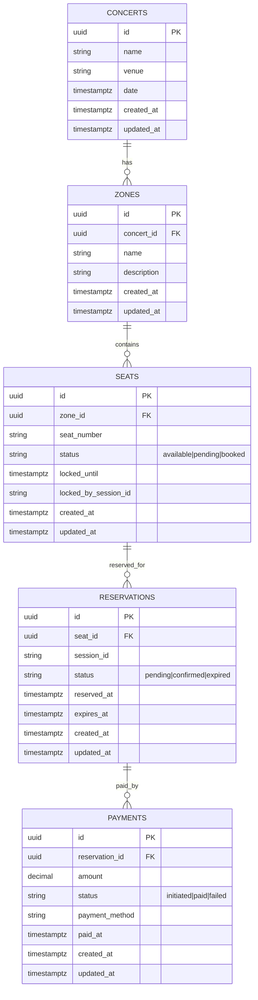

# 🎟️ Ticket Reservation System Design
This document outlines the design of the Ticket Reservation System, focused on managing high-demand concert seat reservations with real-time updates and reliable concurrency control.

## 🧱 Architecture Overview
The system follows Clean Architecture, separating concerns across layers:
- **Domain Layer**: Business models and interfaces
- **Application Layer**: Use cases and orchestration logic  
- **Infrastructure Layer**: Database, Redis, Pub/Sub, WebSocket
- **Delivery Layer**: HTTP APIs

**Technology Stack:**
- **Database**: PostgreSQL with ACID transactions
- **Cache & Locking**: Redis with TTL-based seat locks
- **Transport**: REST APIs (WebSocket optional for real-time updates)

### Database Schema Relationships


## 🗂️ Entities

### Concerts
- Represents a concert with a date and venue

### Zones
- Grouping of seats (e.g., VIP, Zone A)

### Seats
- Unique seat in a zone (e.g., A5)
- Has a state: `available`, `pending`, or `booked`

### Reservations
- Temporary hold on a seat during payment
- Expires after a set time if not paid

### Payments
- Linked to a reservation
- Status: `initiated`, `paid`, `failed`

## 🗃️ Database Tables
- `concerts`: concert metadata
- `zones`: seating zones per concert
- `seats`: seat inventory per zone
- `reservations`: temporary holds on seats
- `payments`: successful or failed payment records
> All timestamp fields use TIMESTAMPTZ to ensure correctness across timezones.

## 🗃️ Redis Keys & Data Structures
| Purpose          | Key Pattern                                     | Data Type | TTL                               |
|------------------|-------------------------------------------------|-----------|-----------------------------------|
| Seat Locking     | `seat_lock:concert:{cid}:zone:{zid}:seat:{sid}` | String    | 5 minutes                         |
| Seat Map Caching | `seat_map:concert:{cid}:zone:{zid}`             | Hash      | 5 minutes (Field-level TTL)       |

### Redis Seat Locking Implementation
The seat locking mechanism uses a simple key-value pair:
```bash
SET seat_lock:concert:{cid}:zone:{zid}:seat:{sid} {sessionID} NX PX 300000
```
- **Key**: Unique identifier for the seat lock
- **Value**: Session ID of the user attempting the reservation
- **NX**: Only set the key if it does not already exist
- **PX**: Set a timeout (TTL) of 5 minutes

### Redis Seat Map Implementation
The seat map uses **Redis Hash with field-level TTL**:
```bash
# Hash structure
HSET seat_map:concert:{cid}:zone:{zid} A1 '{"id":"seat-uuid","status":"pending",...}'
HSET seat_map:concert:{cid}:zone:{zid} A2 '{"id":"seat-uuid","status":"available",...}'

# Field-level TTL for automatic expiration
HEXPIRE seat_map:concert:{cid}:zone:{zid} 300 A1  # 5 minutes for pending seats
# Booked seats have no TTL (permanent)
```

**Benefits:**
- ✅ **Complete seat entities** stored as JSON in Redis
- ✅ **Individual field TTL** - each seat can have different expiration
- ✅ **Performance** - Single `HGETALL` retrieves entire zone seat map

## 🧠 Key Concepts

### ✅ Seat Locking Strategy
When a user selects a seat, a **dual-layer locking mechanism** ensures data consistency:

1. **Redis Lock (First Layer)**:
   ```bash
   SET seat_lock:concert:{cid}:zone:{zid}:seat:{sid} {sessionID} NX PX 300000
   ```
   - Prevents concurrent reservation attempts
   - 5-minute TTL with automatic expiration
   - Fast, distributed locking across instances

2. **Database Row Lock (Second Layer)**:
   ```sql
   SELECT * FROM seats WHERE id = ? FOR UPDATE;
   ```
   - Source of truth verification
   - Protects against Redis failures/restarts
   - ACID transaction guarantees

### ✅ Double Verification Pattern
The system implements a **defense-in-depth** approach:
- **Redis lock** → Fast fail for concurrent users
- **DB row lock** → Definitive state verification
- **Status checks** → Business rule validation
- **Transaction rollback** → Cleanup on failures

### ✅ Expiration Handling
Multi-level expiration management:
- **Redis TTL**: Automatic lock expiration (5 min)
- **DB timestamps**: `locked_until`, `expires_at` tracking
- **Lazy cleanup**: During seat access operations
- **Manual cleanup**: Admin-triggered batch operations
- **Background jobs**: Scheduled cleanup processes

### ✅ State Management
**Seat States:**
- `available` → Can be reserved
- `pending` → Temporarily locked (payment pending)
- `booked` → Permanently reserved (payment confirmed)

**Reservation States:**
- `pending` → Awaiting payment (can expire)
- `confirmed` → Payment successful  
- `expired` → Payment deadline passed

**Payment States:**
- `initiated` → Payment process started
- `paid` → Payment successful
- `failed` → Payment failed (seat released)


## 🏗️ System Components

### Database Layer
- **PostgreSQL**: Primary data store with ACID transactions
- **Entity Repositories**: Clean separation between domain and data access
- **SQL Builder**: Type-safe query building with `go-jet`
- **Migration System**: Version-controlled database schema changes
- **Connection Pooling**: Efficient connection management with `sqlx`

### Caching & Locking Layer
- **Redis**: Distributed caching and locking mechanism
- **Seat Locking**: Distributed locks with automatic TTL expiration
- **Seat Map Caching**: High-performance seat status caching with field-level TTL
- **Error Handling**: Graceful degradation when Redis unavailable

### Business Logic Layer
- **Clean Architecture**: Domain-driven design with clear boundaries
- **Use Cases**: Business logic orchestration and validation
- **Domain Entities**: Core business models and rules
- **Repository Pattern**: Data access abstraction

### API Layer
- **REST APIs**: HTTP endpoints for client interactions
- **Input Validation**: Request validation and sanitization  
- **Error Handling**: Structured error responses with proper HTTP status codes
- **Health Endpoints**: System readiness and liveness checks

### Infrastructure & DevOps
- **Configuration Management**: Environment-based configuration
- **Structured Logging**: JSON-based logging with correlation IDs
- **Distributed Tracing**: OpenTelemetry integration for request tracing
- **Metrics**: Prometheus integration for API performance monitoring
- **Health Checks**: Database and Redis connectivity monitoring
- **Docker Support**: Containerization for deployment consistency

## 🚀 API Design Overview

### Core API Endpoints

#### Concert Management
- `GET /concerts` - List all concerts
- `GET /concerts/:id` - Get concert details
- `POST /concerts` - Create new concert (admin)

#### Zone Management
- `GET /concerts/:id/zones` - List zones for a concert
- `POST /concerts/:id/zones` - Create zone (admin)
- `GET /concerts/:id/zones/:zone_id` - Get zone details

#### Seat Management
- `GET /concerts/:id/zones/:zone_id/seats` - List seat map of a zone
- `POST /concerts/:id/zones/:zone_id/seats/:seat_id/reserve` - Reserve a seat
- `GET /concerts/:id/zones/:zone_id/seats/:seat_id` - Get seat details

#### Reservation Management
- `GET /reservations/:id` - Get reservation status/details
- `DELETE /reservations/:id` - Cancel reservation

#### Payment Processing
- `POST /reservations/:id/pay` - Complete payment for reservation
- `GET /payments/:id` - Get payment status/details

#### Health & Admin
- `GET /health/readiness` - System readiness check
- `GET /health/liveness` - System liveness check
- `POST /admin/cleanup-expired` - Cleanup expired reservations